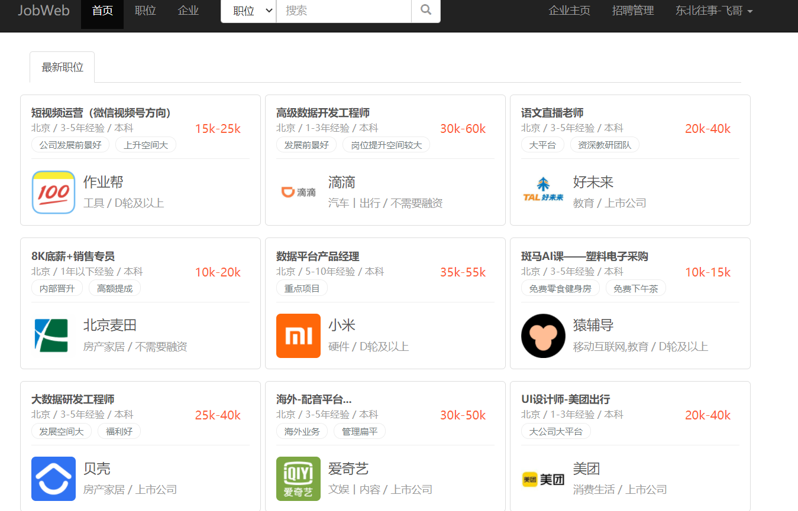
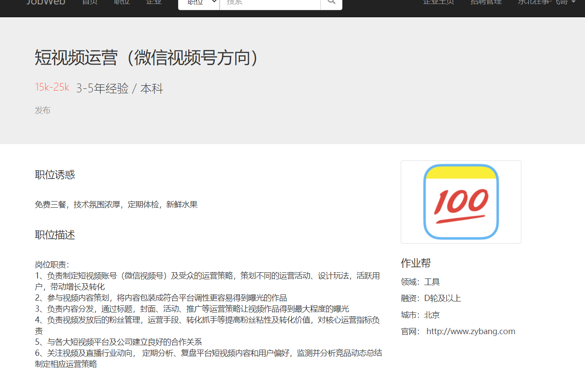
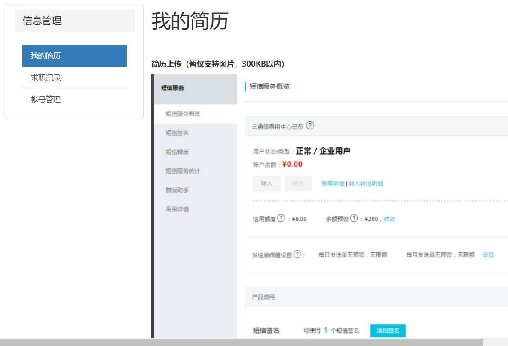
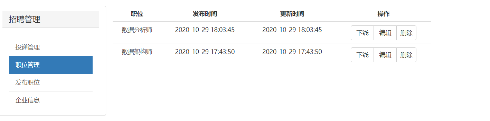
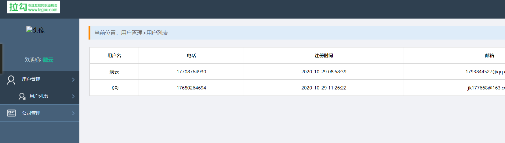
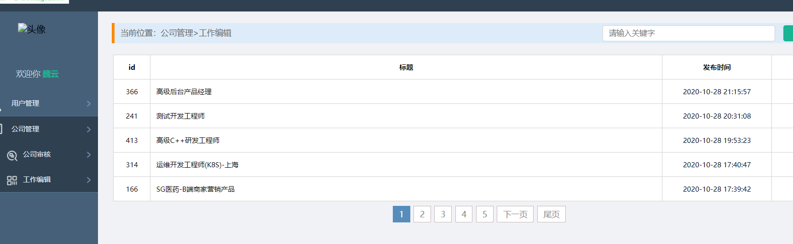

### 声明此项目， fork于 yifanzheng.github.io
### 但是 完全 是本人 自己从头到尾，重新写的一份，
# 简单的招聘网站demo
基于 Flask / Jinja2 / Bootstrap / MySQL 开发，仿照拉勾网的风格，实现了招聘网站的必需功能


## 环境
* Python 3
* MySQL
* redis

## 实现功能
* 个人和企业两种角色的注册登录编辑
* 职位和企业的索引页、详情页及搜索功能
* 个人简历上传和投递操作
* 企业对职位的增删改查上下线，及对简历的反馈处理

| 日期 | 计划 | 完成情况|
|---|---|---|
|2020-10-19|项目的大体设计，数据库的设计，|✔|
|2020-10-20|进行页面展示，用户登录注册，退出，功能|✖|
|2020-10-21|进行详情页展示，搜索功能|✔|
|2020-10-22|个人，企业两种角色 功能|✔|
|2020-10-23|个人简历的，上传，和投递 功能|✖|
|2020-10-24|企业对职位的增伤改查，以及，对简历的反馈处理|✔|
|2020-10-25|管理员的功能 以及实现|✖|
|2020-10-26|管理员的功能 以及实现，修复bug|✔|
|2020-10-27|职位的 功能，修复bug|✖|
|2020-10-28|公司的 功能，修复bug|✔|
|2020-10-29| 进行细节 处理，修复bug||

## 项目流程
### 1. 第一天(2020-10-19)
项目的大体设计，数据库的设计
### 2. 第二天(2020-10-20)
进行页面展示，。。。。 但是登录，注册功能， 还未进行
### 3. 第三天(2020-10-21)
进行页面展示，。。。。 继续完成登录，注册功能的完善，。。
### 4. 第四天(2020-10-22)
进行页面展示，。。。。 继续修复注册页面，注册成功后，不跳转的问题
### 5. 第五天(2020-10-23)
进行页面展示，。。。。 完成搜索功能，。。
### 6. 第五天(2020-10-24)
进行页面展示，。。。。 完成用户上传简历功能，。。
### 7. 第六天(2020-10-25)
进行页面展示，。。。。 完成企业 功能，。。
### 8. 第七天(2020-10-26)
进行页面展示，。。。。 进行职位 后端功能，。。
### 9. 第八天(2020-10-27)
进行 -- 用户的 修改 处理 bug 
### 10. 第九天(2020-10-28)
进行页面展示，。。。。 进行职位 真实数据 ，。。

### 11. 第九天(2020-10-29)

进行bug修复  进行职位 真实数据 ，。。

## TODO
- [ ] 职位和企业的条件筛选
- [ ] 管理员后台和权限功能
- [ ] 简历支持 PDF，并将 PDF 转图片在线浏览
- [ ] 职位和企业该为列表展示
- [ ] 个人对职位收藏


## 项目环境配置

#### 1. 安装 Python 依赖
```sh
$ pip3 install -r requirements.txt
```

#### 2. 修改配置文件

根据自己情况，修改 `config.ini`

主要是 `SQLALCHEMY_DATABASE_URI` 数据库的链接

#### 3. 创建数据库

根据上面配置中的库名，创建数据库

#### 4. 利用 flask-migrate 建表

命令行终端，先进入项目目录，然后依次执行下列命令：

```sh

$ python manage.py db init
$ python manage.py db migrate -m '注释'
$ python manage.py db upgrade
```

#### 5. 生成测试数据（可选）

可执行 [test_data.py](https://github.com/zkqiang/job-web-demo/blob/master/data/test_data.py) 生成一些随机数据


#### 6. 项目运行截图

1. index 首页

2. 工作详情页 

3. 个人用户主页

4.  企业用户 

5. 管理员 后台

6. 工作审核


