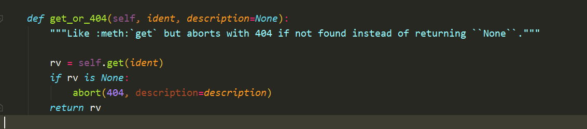
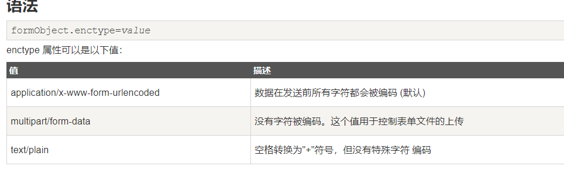

### 项目中所遇到知识点

1.  sqlalchemy . Customizing DDL

    数据定义语言（DDL）。发出时，将调用预定的操作顺序，并无条件创建DDL以创建每个表，包括所有约束和与其关联的其他对象。对于需要特定于数据库的DDL的更复杂的方案，SQLAlchemy提供了两种技术，可用于根据任何条件添加任何DDL，包括表的标准生成或单独添加。 

    官方文档--->[文档](https://www.geek-book.com/src/docs/SQLAlchemy1.3/SQLAlchemy1.3/docs.sqlalchemy.org/en/13/core/ddl.html)

2. Flask扩展系列-用户会话管理

    * Flask-Login  模块

        *  flask_login 是web开发框架flask的一个插件，可以非常方便的管理用户对网站的访问  

        * user 类 

        * ```Python
            # 安装 包
            pip3  install flask-login
            
            
            
            # 初始化 app
            from flask import Flask, render_template, redirect, request
            from flask_login import \
                (LoginManager,
                 current_user,
                 UserMixin,
                 login_required,
                 login_user,
                 logout_user
                 )
            
            app = Flask(__name__)
            app.config['SECRET_KEY'] = 'ijaswe'
            
            login_manager = LoginManager()
            login_manager.init_app(app)
            login_manager.login_view = '/login'
            login_manager.session_protection = 'strong'   # 防止恶意用户篡改 cookies
            
            
            # user 类
            
            user_dict = {}
            
            class User(UserMixin):
                def load_by_user_id(self, user_id):
                    """
                    在实际项目中，这个方法应该从数据库中根据user_id来查询用户信息
                    为了演示方便，我这里省略了从数据库查询数据的过程
                    如果数据库中没有user_id这个用户，你应该返回False
                    :param user_id: 用户唯一标识
                    :return: 
                    """
                    self.user_id = 1
                    self.username = user_dict.get(self.user_id)
                    return True
            
                def get_id(self):
                    return self.user_id
            ```

    * login_required

        *  `@login_required` 会做用户登录检测，如果没有登录要方法此视图函数，就被跳转到 `login` 接入点( `endpoint` ) 
        * `current_user` 是当前登录者，是 `User` 的实例，是 `Flask-Login` 提供全局变量（ 类似于全局变量 `g` ）

    * 使用 Flask-WTF

        * Flask表单：表单数据的验证与处理  
        * 文档------》》》[flask表单](https://www.yiibai.com/flask/flask_wtf.html)

    * Share()    基于jinja2模板创建社交共享组件 

        * [文档](https://flask-share.readthedocs.io/en/latest/)

3. Faker 类

     Python中有一个专门生成各类假数据的库：Faker 

     使用faker 构建测试数据库

4. CKEditor(app)

     是一个非常优秀的 Web 服文本编辑器，提供了非常多的功能和丰富的文档 

5. Moment(app)

     用于处理日期/时间的 Python 库，设计灵感同样是来源于 [moment.js](https://www.oschina.net/p/moment-js) 和 [requests](https://www.oschina.net/p/requests)  

6. get_or_404 方法

     比如:meth: ' get '，但如果没有找到，就会以404终止，而不是返回' ' None ' '。" 



7.   解决  mysql5.7.5之后sql_mode默认值是"only_full_group_by"，不能执行group_by查询 

​	    mysql 中sql_mode 设置win 10 ， MYSQL8以上已经取消了 NO_AUTO_CREATE_USER，sql_mode中不能包含这      个。 

​		在mysql.ini 中设置

8. 用户类 UserMinxin 类， 

​	文档---> [`UserMixin`](http://docs.jinkan.org/docs/flask-login/#flask.ext.login.UserMixin)  

9. form enctype 属性



10. csrf 保护

 	要对所有视图函数启用 CSRF 保护，你需要启用 [`CsrfProtect`](http://docs.jinkan.org/docs/flask-wtf/api.html#flask_wtf.csrf.CsrfProtect) 模块: 

```
from flask_wtf.csrf import CsrfProtect

CsrfProtect(app)
```

11. @property 主要是让password字段无法直接读取

​	@password.setter 修改用户的password 字段  (修改密码)

12. UploadSet

​	 flask可以实现上传文件和下载文件的基本功能，但如果想要健壮的功能，使用flask_uploads插件是十分方便的。 

 	UploadSet对象的主要方法是save,该方法必须传入werkzeug.FileStorage对象作为参数，然后检查文件名是否合法，将其转换；检查文件的扩展名是否允许，不允许抛出UploadNotAllowed()错误；调用resolve_conflict方法解决文件名冲突问题；然后将目录和文件名拼接成绝对路径保存在目录下，最后返回文件名； 

13. patch_request_class

    * **限制文件大小**

        导入patch_request_class()函数，传入应用实例和大小（默认为16MB），比如：

        ```
        patch_request_class(app, 32 * 1024 * 1024 ) 
        ```

        

14. Flask abort   函数

    1. 用于提前退出 一个请求，并用指定的错误码 返回

        

        ```python 
        flask.abort(status, *args, **kwargs) 
        abort(404)
        ```


#### Bootstrap

1. 用于响应式不局，移动设备优先的web 项目架构


